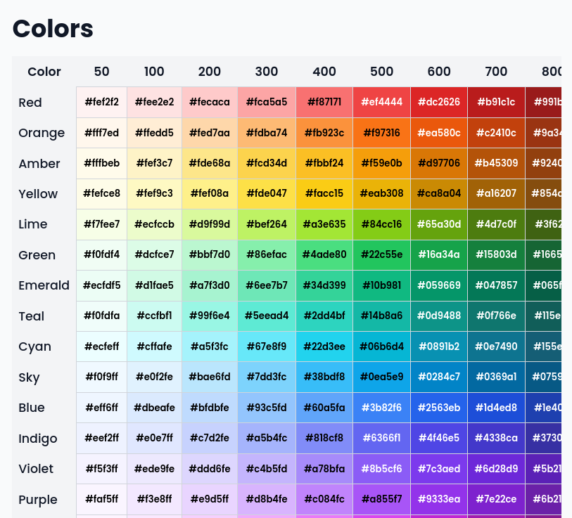
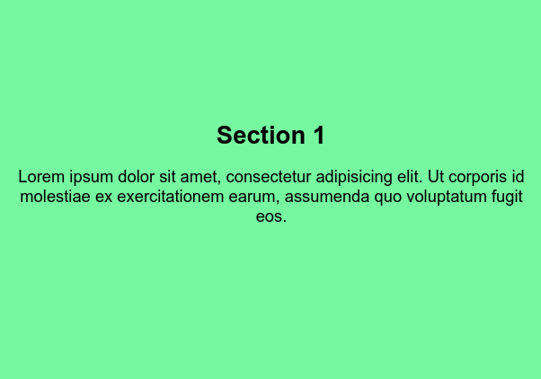
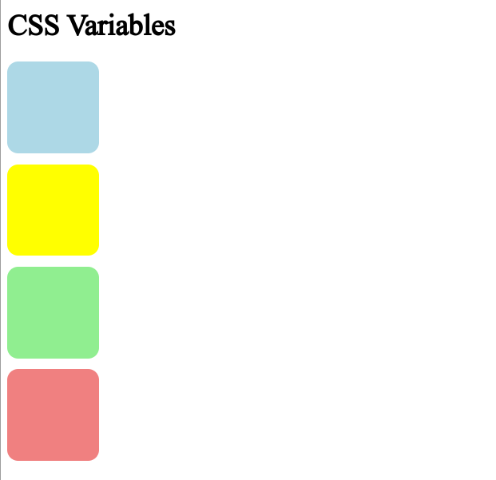
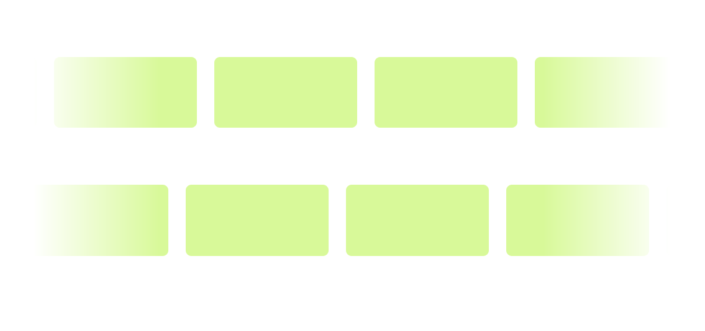
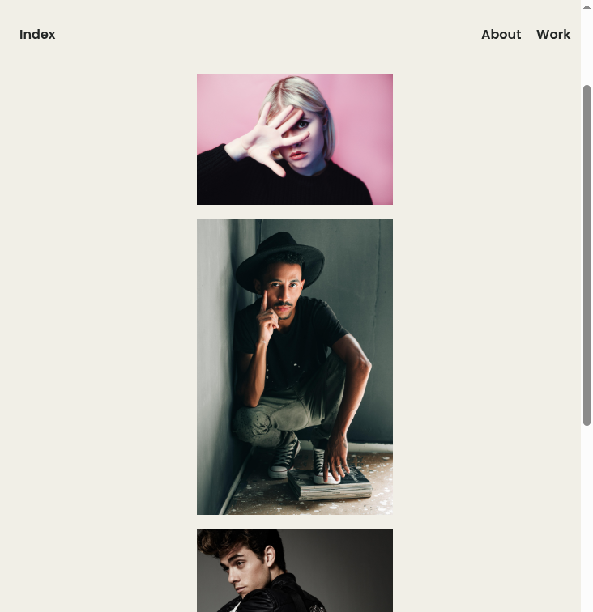
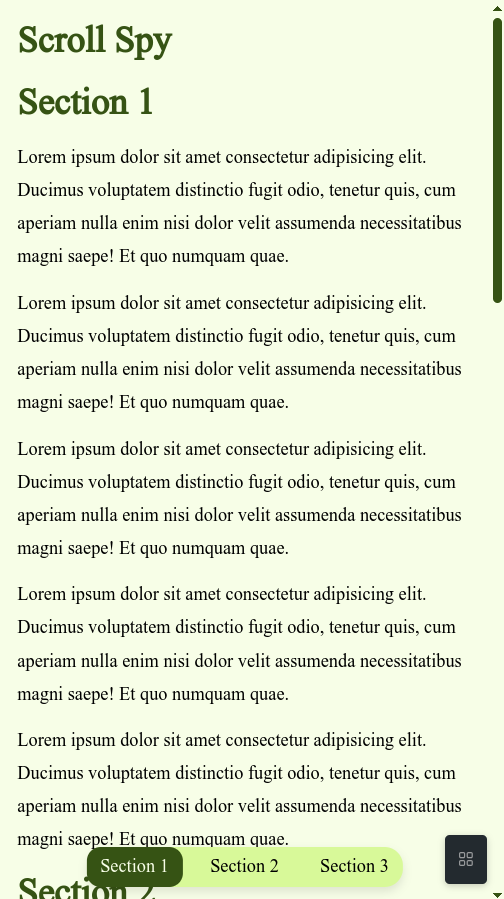

# Vanilla Test Projects

This repository contains a collection of small vanilla HTML, CSS, and JavaScript projects for experimentation and learning. Each folder contains a self-contained example demonstrating a specific concept or feature.

## Project List

- **colors/**: Color palette and manipulation examples
- **css-scroll/**: Custom scroll styling with CSS
- **css-variables/**: CSS variables usage and examples
- **infinite-scroll/**: Infinite scroll implementation
- **js-page-transition/**: Simple page transitions using JavaScript
- **scroll-spy/**: Scroll spy navigation example

## Usage

Open the corresponding HTML file in your browser to view each example. All projects are standalone and require no build tools or dependencies.

## Screenshots

### colors

### css-scroll

### css-variables

### infinite-scroll

### js-page-transition

### scroll-spy

